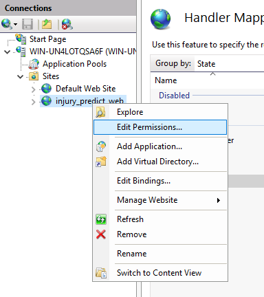

# PA Department of Labor & Industry, Capstone Project

## Background
The Pennsylvania workers’ compensation program was established to reduce injuries and provide lost wages and medical benefits to Pennsylvania employees who become ill or injured on the job so they can heal and return to the workforce. The workers’ compensation system protects employees and employers. Employees receive medical treatment and are compensated for lost wages associated with work-related injuries and disease, and employers provide for the cost of such coverage while being protected from civil lawsuits by employees. Workers’ compensation coverage is mandatory for most employers under Pennsylvania law. Employers who do not have workers’ compensation coverage may be subject to lawsuits by employees and to criminal prosecution by the commonwealth.

The vision is to have a final product which will be able to predict injuries and illnesses before they happen by county and industry. PA staff trainers will utilize this information to conduct proactive training and outreach to high risk counties and industries to prevent incidents.

## This repository contains
- Code to run the web application 
- Code to run the injury rate prediction (SARIMAX, Prophet)
- Code to run the injury cause prediciton (Neural Net)
- Datasets of past claim, employment, and medical cost data
- Documentation from previous teams (reports, presentations, videos)

## Data
There three main datasets that this project works with:
- **Claim data** = WCAIS, Workers' Compensation Automation and Integration System (aka FROI, First Report of an Injury)

    These yearly datasets record the individual claims that workers submit when they are injured in the workplace. They are submit within 3 weeks of the injury and reflect an early injury cause and nature. Currently, we have data from 2014-2021. This may also be referred to as FROI data, First Report of Injury. WCAIS and FROI can be used interchangably for the scope of this project. 

- **Employement data** = QCEW, Quarterly Census of Employment and Wages 

    These yearly datasets display the total number of workers in Pennsylanvia my county, industry, and month. The rows quarterly values by county and industry, while the columns month1, month2, and month3 correspond to the first, second, and third month of the quarter. This data is joined with the claim data to calculate injury rates per county, industry, and month. Currently, we have data from 2014-2021. 

- **Medical cost data** = PCRB, Pennsylvania Compensation Rating Bureau

    This dataset holds the medical costs charged and paid per claim number for the years 2014 to 2019. This data can be joined with the claim data to get a better picture of the initial claim data and final medical costs. 

Reach out to the Department of Labor and Industry for them to send you the full datasets. 

## Setup
The current solution is:
- a [Django web application](https://www.djangoproject.com/), that is 
- hosted on [Internet Information Services](https://learn.microsoft.com/en-us/iis/get-started/whats-new-in-iis-10-version-1709/new-features-introduced-in-iis-10-1709) (aka IIS), that
- uses a [Microsoft SQL Server Management Studio](https://learn.microsoft.com/en-us/sql/ssms/download-sql-server-management-studio-ssms?view=sql-server-ver15) (SSMS) database, and 
- displays in a [Power BI](https://powerbi.microsoft.com/en-us/) report  

To setup the solution on your application, follow the below steps. 

### Set up **requriments** 
- Download [Microsoft SQL Server Management Studio (SSMS)](https://docs.microsoft.com/en-us/sql/ssms/download-sql-server-management-studio-ssms?view=sql-server-ver15)
- Download [Build Tools for Visual Studio 2022](https://visualstudio.microsoft.com/downloads/)
    - Download the application
    - Check off "Desktop development with C++" in the installer
    
- Download [Python 3.8](https://www.python.org/downloads/windows/)
- Download [Power BI Desktop](https://powerbi.microsoft.com/en-us/desktop/)

### Set up **development**
To run the application in development, you need to create the database, close the repository, activate a virtual machine, and run the Django server.  

**Create the database**

1. Create a database called `injury_predict_db` in Microsoft SQL Server Management Studio
    - Open MSSMS and connect to the SQL Server
    - In object explorer, right click on Databases and select New Database
        
    - Name the database `injury_predict_db`
        
2. Enable SQL Server Authentication
    - Right cick on the server from the object explorer
    - Select properties then navigate to security  
        
    - Select SQL Server authentication
        
    - Press ok - you will need to restart the database afterwards
3. Create a database user
    - Right click on Security from the object explorer
    - Navigate to New -> Login  
        
    - Set Login name: `injury_predict_user`
    - Set authentication mode to SQL Server authentication
    - Specify a password and remember it
    - Unselect Enfore password expiration
    - Set the default database to `injury_predict_db`

        
    - Navigate to User Mapping tab
    - Select map to `injury_predict_db`
    - Select `db_owner` for the role membership

        

**Clone the repository and update settings file**

In development, the repository can be clone to wherever you'd like to store it. In production, the repository needs to be stored in the `C:\inetpub\wwwroot` for IIS to use it. As of now, clone the repository to wherever you prefer. 

1. (If needed) [Connect to github](https://docs.github.com/en/get-started/quickstart/set-up-git#authenticating-with-github-from-git) from git and command line. 
2. [Clone](https://docs.github.com/en/repositories/creating-and-managing-repositories/cloning-a-repository) the repositroy to your preferred directory. 
3. Modify the settings.py file with your password and database host. The host name is the the top line in the SSMS object explorer, it may be also called the Server. 

    

**Activate the virtual machine**

1. (If needed) Download [Anaconda](https://www.anaconda.com/).
2. Open Anaconda Prompt. 
3. Go to the respository main directory. 
4. Go to the web application: 
    ```
    cd injury_predict_web
    ```
5. Create new virtual environment
    ```
    conda create --name py38 python=3.8
    ```
6. Activate a conda 3.8 environment
    ```
    conda activate py38
    ```

**Install requirements and launch web application**

This launches the web application using the Django development server. This is to only be used when developing. 

1. Install requirments.txt
    ```
    pip install -r requirements.txt
    ```
2. Make migrations from changes in Django model
    ```
    python manage.py makemigrations
    ```
3. Apply migrations
    ```
    python manage.py migrate
    ```
4. Create superuser (username = admin, password = admin) 
    ```
    python manage.py createsuperuser
    ```
5. Collect static assets
    ```
    python manage.py collectstatic
    ```
6. Initialize the database
    ```
    python manage.py initialize_db
    ```
7. Open a second Anaconda Prompt. 
    
    a. Go to the web application.
    ```
    cd injury_predict_web
    ```
    b. Activate the conda envrionment
    ```
    conda activate py38
    ```
    c. Run background tasks.  
    ```
    python manage.py process_tasks
    ```
8. Switch back to the original Anaconda Prompt.
9. Run server -- Go to the IP address in the response and the web application should open! 
    ```
    python manage.py runserver
    ```
10. Deactivate when finished
    ```
    conda deactivate
    ```

### Set up **production**

To be further completed. Will include:
- Hosting on IIS
- Configure FastCGI
- Running Server 2019
- Registering backend service
- Launching the application

### Accessing Power BI

The database can be connected to a Power BI report to visualize the results. 

1. Download [Power BI Desktop](https://powerbi.microsoft.com/en-us/desktop/)
2. Open the Power BI report in the root of the repository: `FinalPowerBIReport.pbix`
3. When prompted to add credentials, click CANCEL and/or Close X until the window closes.  

4. Select File > Options and settings > Data source settings. 

5. Select "Change source" in the bottem left. 

6. Enter your database server and username (injury_predict_user) that you specified in database setup. 

7. Select OK > Close and apply the changes. 

The dashboard should now update with the new data source!

## Tutorial
Here are video demonstrations of the solution: 
- [Spring 2022](https://drive.google.com/file/d/1E5YtlaCgejJTOZEHaMzAQPxPHFuOxQZ3/view)
- [Fall 2021](https://www.youtube.com/watch?v=xsFJB-8iWn4)

## Past documentation

<details>
<summary>Fall 2022</summary>

### Objectives
- Integrate medical costs into current prediction model to account for injury severity
- Enable team to run and analyze predictions on their computers

</details>

<details>
<summary>Spring 2022</summary>

## MISM_CapstoneProject_2022Spring
MISM Capstone Project-PA
In 2020-Spring, we add a new prediction model based on neural network to predict the nature code of a user profile.

## User guide
+ Open the protal and click on the neural tab.

+ Upload the predicted user profile file, for example, sample/sample_neural_data.xlsx, select the data type

+ Click on submit, and we could get the predicted result. The table will display all the predicted nature cause, and the pie chart will show the nature cause distribution.


</details>

<details>
<summary>Fall 2021</summary>
This is an internal git repository for CMU PA Department Capstone 2021 Fall. This application allows the PA Department of Labor and Industry to forecast future workman's comp claims by each county and NAICS code.

## Deploy Application
This guide will take you through the process of initially deploying the application to a Windows Server using Windows Internet Information Services (IIS) and Microsoft SQL Server.
### Set Up Windows Environment
#### Requirements
- Windows Server 2019
- Microsoft SQL Server 2019
- [Microsoft SQL Server Management Studio (SSMS)](https://docs.microsoft.com/en-us/sql/ssms/download-sql-server-management-studio-ssms?view=sql-server-ver15)
- [Build Tools for Visual Studio 2022](https://visualstudio.microsoft.com/downloads/) 
    Once downloaded, install Desktop development with C++ package
    
- [Python 3.7.9](https://www.python.org/downloads/windows/)

#### Setup MS SQL Server Database
1. Create a database(`injury_predict_db`) using Microsoft SQL Server Management Studio
    - Open MSSMS and connect to the SQL Server
    - In object explorer, right click on Databases and select New Database
        
    - Name the database `injury_predict_db`
        
2. Enable SQL Server Authentication
    - Right cick on the server from the object explorer
    - Select properties then navigate to security  
        
    - Select SQL Server authentication
        
    - Press ok - you will need to restart the database afterwards
3. Create a database user
    - Right click on Security from the object explorer
    - Navigate to New -> Login  
        
    - Set Login name: `injury_predict_user`
    - Set authentication mode to SQL Server authentication
    - Specify a password and remember it
    - Unselect Enfore password expiration
    - Set the default database to `injury_predict_db`
        
    - Navigate to User Mapping tab
    - Select map to `injury_predict_db`
    - Select `db_owner` for the role membership
        
#### Setup Internet Information Services (IIS)
1. Install IIS
    - Navigate to the control panel
    - Select "Turn Windows features on or off"
        
    - Select Add roles or features
        
    - Select Web Server (IIS)
        
    - Select CGI under Role Services
        
    - Install
### Install Application
#### Run Installation Scripts
1. Clone this repository to the `C:\inetpub\wwwroot` directory.
    
2. Modify the `settings.py` file
    - Edit MS SQL Server connection information specified earlier
    
2. Navigate to `C:\inetpub\wwwroot\Capstone_F2021` in command prompt (***make sure to run as administrator***)
3. Run `install.bat`  
    
4. Enter desired credentials for the administrator of the app when prompted
5. Wait for installer to finish - this may take a while
#### Setup FastCGI Application
1. Launch IIS Manager
2. Configure FastCGI settings
    - Navigate to FastCGI settings
        
    - Select Add Application...
    - Set Full Path: `C:\inetpub\wwwroot\Capstone_F2021\injury_predict_web\pyenv\Scripts\python.exe`
    - Set Arguments: `C:\inetpub\wwwroot\Capstone_F2021\injury_predict_web\pyenv\Lib\site-packages\wfastcgi.py`
    - Right click on dots next to Environment Variables
        
    - Add the following variables:
        - WSGI_HANDLER: injury_predict_web.wsgi.application
        - PYTHONPATH: C:\inetpub\wwwroot\Capstone_F2021\injury_predict_web
        - DJANGO_SETTINGS_MODULE: injury_predict_web.settings
        
7. Add new website
    - In IIS, right click on the Sites folder in the connections window
    - Select Add Website...  
        
    - Set Site name: `injury_predict_web`
    - Set Physical path: `C:\inetpub\wwwroot\Capstone_F2021\injury_predict_web`
    - Set port number: `8888` (you can use another if already in use)
        
7. Add handler mapping
    - From IIS, click on Handler Mappings
        
    - Click Add Module Mapping...
    - Set Request path: `*`
    - Set Module: `FastCgiModule`
    - Set Executable: `c:\inetpub\wwwroot\capstone_f2021\injury_predict_web\pyenv\scripts\python.exe|c:\inetpub\wwwroot\capstone_f2021\injury_predict_web\pyenv\lib\site-packages\wfastcgi.py`
    - Set Name: `Django Handler`  
        
    - Select Request Restrictions...
    - Uncheck Invoke handler  
        
    - Click ok. When asked to create a FastCGI application press no.
#### Configure Application Files
1. Collect static files
    - Launch command prompt as an administrator
    - Navigate to `C:\inetpub\wwwroot\Capstone_F2021`
    - Run `collectstatic.bat`
2. Setup static directory
    - From IIS manager, right click injury_predict_web and press Add Virtual Directory
        
    - Set Alias: `static`
    - Set Physical path: `C:\inetpub\wwwroot\Capstone_F2021\injury_predict_web\static_for_deploy`
        
3. Setup media directory
    - From IIS manager, right click injury_predict_web and press Add Virtual Directory
    - Set Alias: `media`
    - Set Physical path: `C:\inetpub\wwwroot\Capstone_F2021\injury_predict_web\media`
4. Edit Handler Mappings
    - From IIS manager, select the `static` folder from under the `injury_predict_web` site
    - Select Handler Mappings
        
    - Select View Ordered List...
    - Move the order of StaticFile to the top of the list
4. Alter file permissions
    - From IIS manager, right click injury_predict_web and press Edit Permissions...
        
    - Navigate to Security
    - Select Edit..
    - Select Add..
    - For the object name specify `IIS AppPool\injury_predict_web`
        
    - Press ok
    - Check allow full control
    - Apply
5. Alter python permissions
    - In documents navigate to `C:\Users\username\AppData\Local\Programs\Python` or where you installed the Python files
    - Right click on the Python37 folder and select edit permissions
    - Follow the same steps as above to edit permissions for these files
    - The user only needs Read & Execute, List folder contents, and Read permissions
#### Register Backend Service
1. Install NSSM
    - Download [NSSM](https://nssm.cc/download)
    - Extract the nssm application to a directory on the server
    - Add that directory to the PATH environment variable
        - Navigate to System Environment Variables
        
        - Select Environment Variables...
        - Add the NSSM directory to the PATH variable
            
2. Register the app backend service
    - Launch a new command prompt as an administrator and run the following command:
    `nssm install "injury_predict_backend" "C:\inetpub\wwwroot\Capstone_F2021\injury_predict_web\pyenv\Scripts\python.exe" "C:\inetpub\wwwroot\Capstone_F2021\injury_predict_web\manage.py process_tasks"`
    - Restart the server
### Launch Application
You should now be able to launch the application by navigating to [http://localhost:8888/](http://localhost:8888/) in a browser (or change `8888` to the port you specified). Then login using the admin login you specified during the installation process. New user accounts can be created through the admin tab of the application.
## Running the Application
Please refer to the following tutorial for how to use the application: [tutorial](https://youtu.be/xsFJB-8iWn4)
## GitHub Repo Configuration
### Guide for setting up Bandit SAST pre-commit hooks:

- run `pip install pre-commit`
- copy the `.pre-commit-config.yaml` file into main repository.
- run `pre-commit install`
    - Everytime the .pre-commit-config.yaml gets changed, this command needs to be ran again
- To run all pre-commit hooks on all files manually without committing `pre-commit run --all-files`
    OR
- To run certain pre-commit hooks `pre-commit run <hook_id>`
- To commit w/o pre-commit checks, run `git commit -m <message> --no-verify`

</details>


