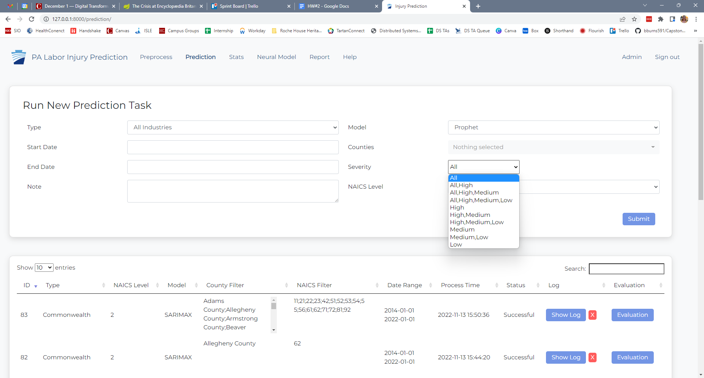

# Change Log: Prediction Module

This README file discusses changes that were made throughout different iterations of the Capstone project. 

## Fall 2022
The major changes to the prediction model that we made were: 
- Extend prediction by severity
- Export button to download prediction output CSV

### Extend prediction by severity
Pull request: https://github.com/bburns591/Capstone_S2022/pull/5

The [prediction_controller.py](https://github.com/bburns591/Capstone_S2022/blob/master/injury_predict_web/utilities/predict_controller.py) file controls the main predicting functionality. The forecast_injury_rates() function runs a [loop](https://github.com/bburns591/Capstone_S2022/blob/5647de16f6c007f2c53c8eb7a9a9986a1fcc533a/injury_predict_web/utilities/predict_controller.py#L479) to call .predict() for the specified model type and for each forecast group. Forecast groups are all the possible combinations between the NAICS, county, and severity options that were specified by the user. 

We added severity as an option in the prediction configuration for a user to specify which severity buckets they want to predict for. 

The **All** value is the total injury rate for a specified NAICS and county. The **High, Medium, and Low** values are injury rates of "All" broken down using a claim's assigned severity bucket. 

### Export button to download prediction output CSV
Coming soon. 

### Challenges & notes
- In practive, the PA team only will run predictions when they have new data. They also want to run full predictions, all counties, all NACIS, all severity levels. The flow for configuring predictions will only be used 1-2 times per year. 
- Front end is not our strength. There was some issues using the same CSS on the prediction form, therefore we used standard html styling and did not use the CSS that the rest of the form has to add the severity selector. We also had issues passing the data of a multiselector to the backend, so we decided to provide a simple single selector with all the options written out. We decided not to prioritize the form design because the dashboard and prediction results were more important to the PA team. 
- The prediction is not in a loop for each group. The more NAICS, counties, and severities chosen, the longer the prediction task will take to run. This does not scale well. 