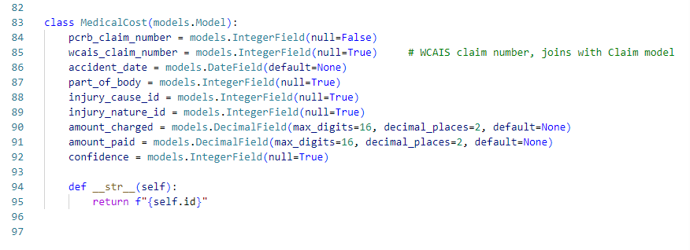
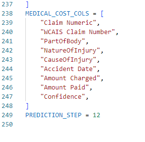
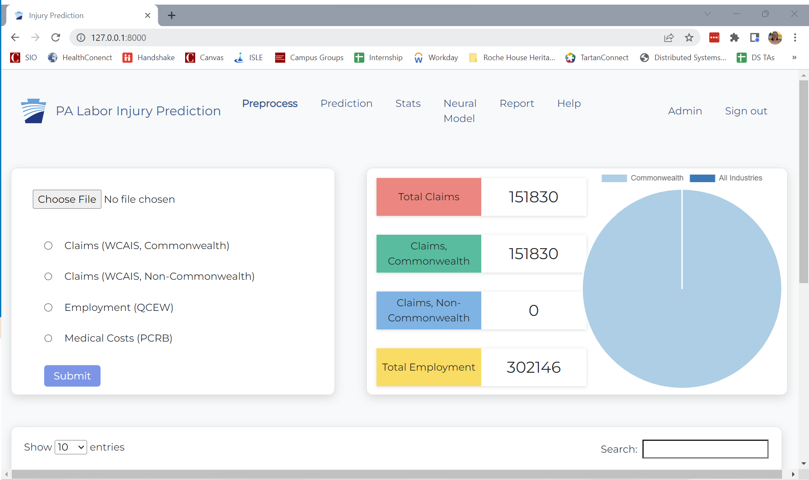
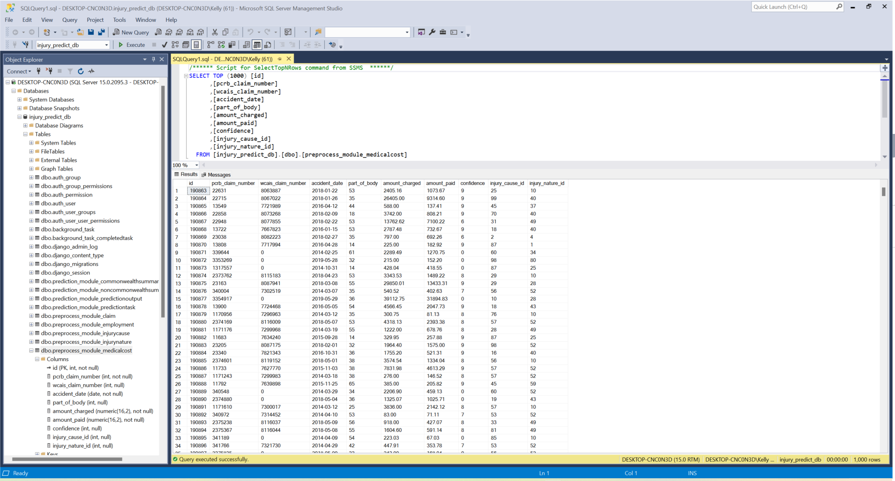

# Change Log: Preprocess Module

This README file discusses changes that were made throughout different iterations of the Capstone project. 

## Fall 2022
The major changes to the preprocessing module during this iterations were: 
- Upload medical costs to the database 
- Impute a claim's missing medical costs with median value
- Assign a claim a severity level using pre-trained jenks natural breaks model. 

### Upload medical costs to the database 
The PA team wanted us to integrate medical costs into the current model. To do this, we needed to store medical costs in the SQL Server database. 

#### Creating the MedicalCost Django model and table
Pull request: https://github.com/bburns591/Capstone_S2022/pull/4

To do this we first created a new model, MedicalCost, in the `preprocess_module/models.py` file: 

To create a table in this database with new model, you have to run:
```
python manage.py makemigrations
```
and
```
python manage.py migrate
```
These commands allow django to recognize the changes to the database stucture and then apply those changes. 

#### Building MedicalCosts ETL to upload medical costs to database
Pull request: https://github.com/bburns591/Capstone_S2022/pull/4

We created a new file, `utilites/etl_medical_costs.py`. This file mimics the ETL of claims and employment data that was already embedded in the app to preprocess the medical cost data and upload it to the database. 

The main method in the medical costs ETL is preprocess(). This method is called in `utilities/etl_controller.py` and runs the subsequent methods to check, filter, and fix columns. 

The medical costs columns are checked against the list MEDICAL_COST_COLS specified in the `settings.py` file. The columns of the imported medical costs data must match the column names in this list. 


To upload the medical costs to the database, you use the file selector to select the medical costs file. This will likely be called PCRB.csv or something similar. You then select the "Medical Costs (PCRB)" radio button and hit submit. 


This will run the etl_medical_costs to clean and upload the data to the medical costs table in the database. 


### Impute claims that do not have medical costs
Pull request: https://github.com/bburns591/Capstone_S2022/pull/7

In the claim upload flow, we added or changed two steps to `utilites/etl_claim`, those are: 
- impute_medical_costs
- get_severity

In the `impute_medical_costs()` function, we join the new uploaded claims data with the medical_costs table in the database to link a medical cost to the claim. 

** Medical cost data should be uploaded to the database prior to and claim data in order to assign severity using medical costs. **

If a claim does not have a medical costs, we imput the value using a stored `Data/median_medical_costs.csv` table that holds the median values be each NAICS, injury cause code, and injury nature code combination. These values were calculated using 2014-2021 claims and 2014-2019 medical cost data. Outliers were removed. We decided to store this in a csv to reduce the computation time and ensure the correct medians are being used regardless of the data stored in the database. 

If new claims of medical costs data is recieved from the PA, the stored medians csv should be updated in the repository. 

### Assign severity to claim
Pull request: https://github.com/bburns591/Capstone_S2022/pull/7

In the `get_severity()` function, we use the medical cost to assign each claim into a severity bucket: High, Medium, or Low. Severity is used to guide the PA team to counties and industries that have higher cost, and presumedly more severe, injuries. 

To assign severity values to the claim, we trained a jenks natural breaks algorithm, https://pypi.org/project/jenkspy/. In jenks natural breaks, you provide one column and specify the number of buckets and the algorithm finds the most "natural" breaking points into the number of buckets. We cleaned the data and removed outliers before training the model with 2014-2021 claims data and 2014-2019 medical costs data.  

We fed the model the "amount_paid" column of medical costs and it found the following buckets: 
- **Low** = $0 to $9,689
- **Medium** = $9,689 to $38,201 
- **High** = $38,201+

We then stored the jenks model in the Data folder. Using the stored model, we assign new claims to a severity bucket in the `get_severity()` method of the claim ETL. 

The jenks natural breaks model is simply, but it provides an easy to understand way that we are using costs to assign severity levels. 

### Challenges & notes
- We had issues with using foreign key datatypes in the databse, connecting claim IDs to the wcais_claim_number on the medical costs table in the database. We decided to not complicate the database with foreign keys and simply add the values as integers. When using the database data in python, we can merge on keys and create a merged dataframe of the data. 
- Not all claims have an associated medical cost. There is missing data and not all claims have a medical cost because the claims data and medical costs data come from two different reporting sources, WCAIS and PCRB. Around 25% of the all claims between 2014 to 2022 have a medical cost. This led us to imput missing values in order to use medical costs as a value in assigning severity.
- Imputting medical costs using median is a simple, but effective method. We tested imputing medical costs with Linear Regression, Lasso, Ridge, Decition Tree, Random Forest, and XGBoost models, however using the median grouped by NAICS, injury cause code, and injury nature code had the highest R^2 and lowest MAPE and MAE values. The median is also a very easy to communicate method to the PA team. 
