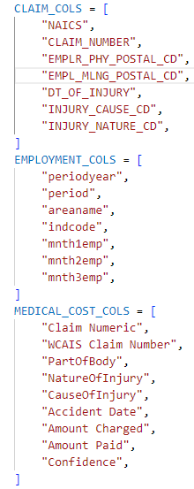
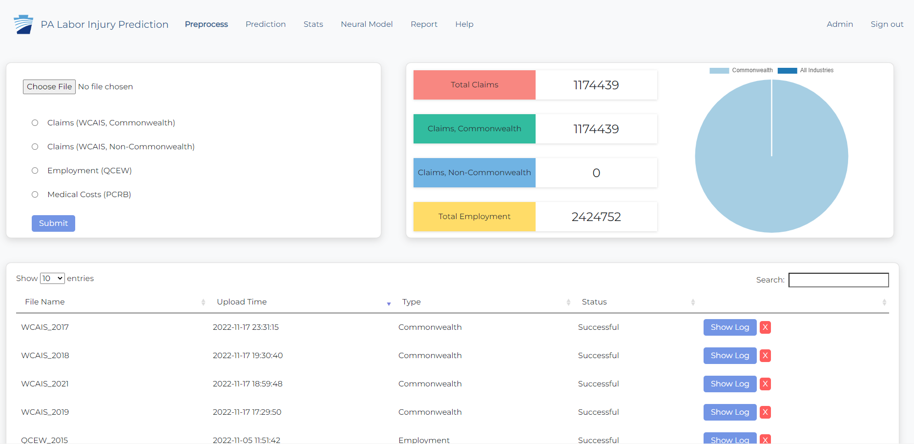
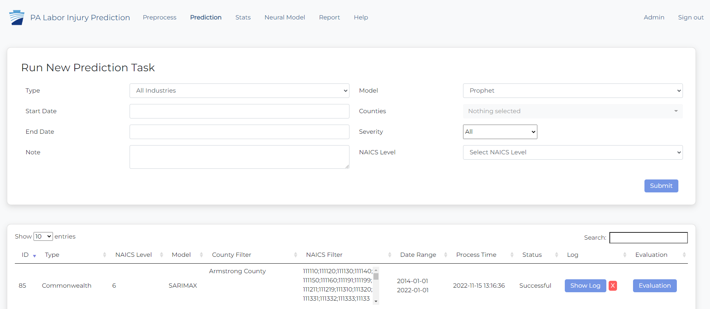

# Onboarding
This document will discuss: 
- Uploading data through the website to populate the database
- Running predictions on the website
- Analyzing predicitions in Power BI

## Uploading data to the database
There are three types of data that are used in the injury prediction tool: 
- Claims (WCAIS)
- Employment (QWEC)
- Medical Costs (PCRB)

To run predictions, all of the data needs to be uploaded to the database. 

Before: Make sure you have the yearly excel files of WCAIS, QCEW, and PCRB data on hand. The files must have column names included in the file in order to be uploaded to the database.  

Steps:
1. Open the injury prediction application and navigate to the "Preprocess" tab. 

2. Choose a file to upload using the file picker. Upload files in the following order: 
    - Medical Costs
    - Claim
    - Employment
    
    Medical cost data must be uploaded before claim data in order to link claims with their associated medical cost and assign severity using the medical cost. 

3. Select the radio button that corresponsds with the file. Commonwealth and Non-Commonwealth are legacy tags for the claims. If you are choosing to use this as a filter in the prediction, you can select the value you prefer. Else, we recommned uploading all claim number under Commonwealth. 

4. Click Submit. 

The file will begin to upload and you will be able to see the log that describes the status of the upload. If an error occurs, remove the file and try again. Or, contact the administrator or CMU team. 

## Running predictions on the website
Once the Claims, Medical Cost, and Employment data is imported into the database. You can run a prediction. 

Steps: 

1. Navigate to the "Prediction" tab.   

2. Chose filters to configure your prediction task. 
    - SARIMAX model is quicker than Prophet. 
    - Selecting only severity "All" will run the quickest. 
    - To run a full prediction with all data, you can select: 
        - Date range the length of the data you have in the dataset. 
        - Model = SARIMAX
        - Counties = Select all. 
        - Severity = All, High, Medium, Low
        - NACIS Level = 6
        - NAICS = Select all. 

    This will take a while to run, but will provide you with the most up-to-date predictions for all counties and all NAICS. 

3. Click Submit. 

4. View the evaluation report for you prediction task by clicking on the "Evaluation" button. This will only show the report for the last county, NAICS, and severity combination ran in the prediction task. 

5. Navigate to the Power BI report to analyze the results of the prediction. 

## Analyzing predictions with Power BI

Coming soon.

